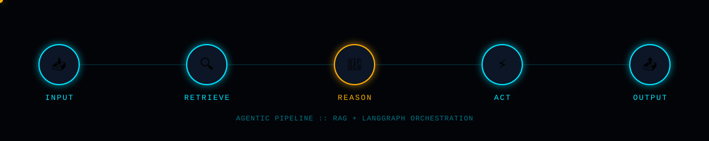

 

### 🌱 About Me

I'm Yugal, a final-year Electronics & Telecommunication engineering student at **VIIT, Pune**. I started out with classic ML algorithms, got curious about how far "an LLM that can actually *do* things" could go, and now I spend most of my time on **RAG pipelines, agentic workflows, and way too many documentation tabs**. Hardware background, software heart.

My focus is building **systems that work end-to-end** — every project here is an attempt to close the gap between a cool AI demo and something that actually holds up under real use.

### 💭 What I Believe In

> AI isn't magic — it's engineering with a probabilistic core. My job is to make that core reliable.

- 🧩 **Agents over answers** — I care less about a single clever prompt and more about systems that plan, retrieve, act, and correct themselves.
- 🛠️ **Ship it, don't just design it** — a working prototype teaches more in a week than a whitepaper does in a month.
- 📚 **Retrieval is the unglamorous superpower** — most "AI problems" are actually context problems. Fix the context, fix the model.
- 🌍 **Build for the real world** — latency, cost, and real users matter more than a leaderboard rank.

### 🎯 The Vision

<table>
<tr>
<td align="center" width="25%">

**🧠** Master agentic AI systems — RAG, GraphRAG, multi-agent orchestration

</td>
<td align="center" width="25%">

**🚀** Ship a flagship project that proves it, not just claims it

</td>
<td align="center" width="25%">

**💼** Break into an AI/ML role and grow fast

</td>
<td align="center" width="25%">

**🌍** Take it global — build AI systems that automate real work

</td>
</tr>
</table>

Chasing a seat at the table as a builder — direct-hire, no detours.

### 🔭 Currently Building

**🧠 Bruven** — my flagship project, a personal RAG assistant that pulls context from real data sources (Gmail, Calendar, PDFs, Obsidian, voice notes) through Qdrant with LLM-powered filter extraction. Now getting a LangGraph-based agentic upgrade: multi-tool orchestration, reflection/critic loops, and long-term memory.

### 🗂️ Featured Projects

<table>
<tr>
<td width="50%">

**🎙️ [On-device Meeting Assistant](https://github.com/yugal072/On-device-meeting-assistant)**
 Built for the AMD Hackathon — an assistant that listens, understands, and helps you remember meetings, entirely on-device, no cloud round-trip.

</td>
<td width="50%">

**🚗 [Toy Car Obstacle Detection](https://github.com/yugal072/toy-car-obstacle-detection)**
 Where the ENTC in me meets the AI in me — real-time obstacle detection running on hardware.

</td>
</tr>
<tr>
<td width="50%">

**🔍 [Simple Search Engine](https://github.com/yugal072/simple_search_engine)**
 Built a search engine from scratch to understand ranking, indexing, and retrieval — the same bones that power every RAG system I build now.

</td>
<td width="50%">

**🐾 [Jiva Shelter](https://github.com/yugal072/Jiva-Shelter)**
 A pet adoption platform, built to connect animals with people looking to give them a home.

</td>
</tr>
</table>

### 🧰 Tech I Reach For

**Currently deep in:** RAG · GraphRAG · LangGraph · CrewAI · AutoGen · PEFT / LoRA / QLoRA

### 📈 The Grind

I'm always up for talking about agentic systems, RAG architectures, or how to make AI actually useful instead of just impressive. If you're building, hiring, or just curious — reach out.

  

💡 "The best way to predict the future is to build it."

